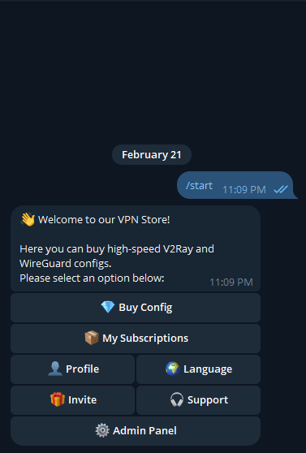
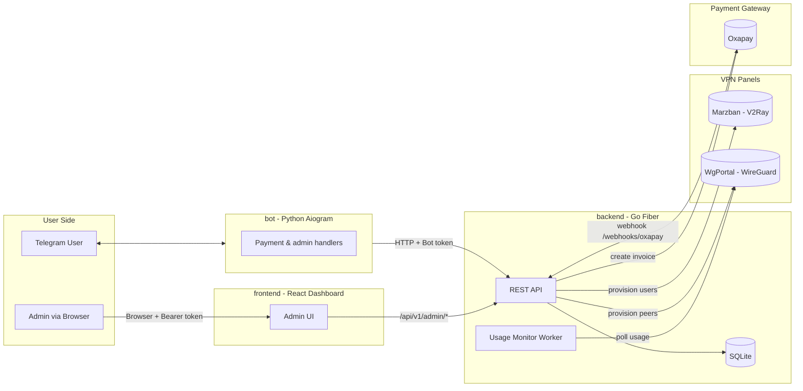
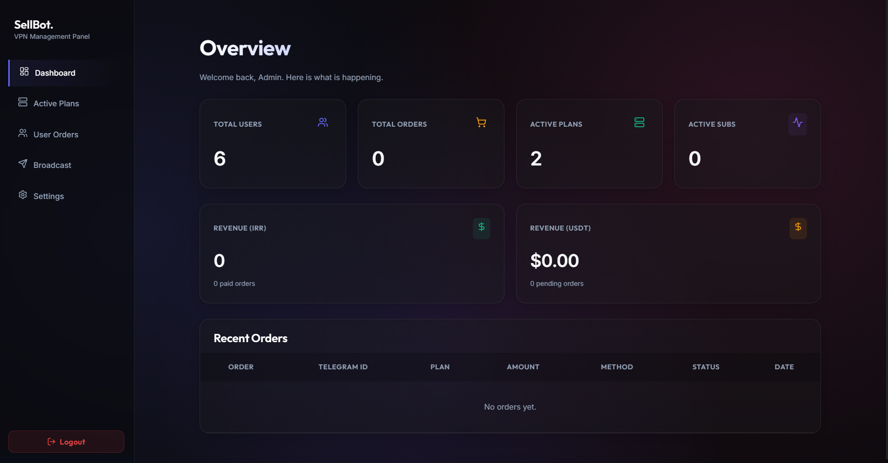

# VPN Seller Bot

[](https://github.com/knownasmobin/seller/actions/workflows/ci.yml)

A high-performance VPN sales platform powered by:

- **Go backend** (`Fiber` + `SQLite`)
- **Python Telegram bot** (`aiogram`)
- **React admin dashboard** (`Vite` + `Tailwind CSS`)

The system integrates with **Marzban (V2Ray)** and **WgPortal (WireGuard)**, and supports both **automated crypto payments (Oxapay)** and **manual card-to-card approvals**.

> Frontend-specific setup is documented in `frontend/README.md`.



## Features

- Multi-protocol provisioning for `.conf` and `vless://` links via Marzban and WgPortal
- Automated crypto payments with Oxapay + manual receipt-based payment approvals
- WireGuard usage enforcement through background workers that disable over-limit peers
- Telegram-native admin actions (approve/reject payments, manage plans/endpoints, manual provisioning)
- User profile and subscription management (remaining days, traffic usage, connection links)
- Invite/referral deep-link flow
- Geographic endpoint selection for plan purchases
- Bilingual bot UI (English/Persian)

## Architecture

This repository follows a 3-tier architecture:

1. **`/backend` (Golang/Fiber):** REST API, SQLite persistence, integrations, background workers
2. **`/bot` (Python/Aiogram):** Telegram UI client that communicates with backend APIs
3. **`/frontend` (React):** Admin dashboard for operations and monitoring

### System Diagram





## Setup (Docker)

### 1) Clone the repository

```bash
git clone https://github.com/knownasmobin/seller.git
cd seller
```

### 2) Configure environment variables

```bash
cp .env.example .env
```

Set required values in `.env` (at minimum):

- `BOT_TOKEN`
- `ADMIN_ID`
- `ADMIN_CARD_NUMBER`
- `OXAPAY_MERCHANT_KEY`
- Marzban and WgPortal URLs/credentials

### 3) Start services

```bash
docker-compose up -d --build
```

Default runtime ports:

- Backend API: `3000`
- Frontend proxy: `8085`
- Telegram bot: containerized worker

## Local Development

### Backend

```bash
cd backend
go mod tidy
go run main.go
```

### Telegram bot

```bash
cd bot
python -m venv venv
source venv/bin/activate
pip install -r requirements.txt
python bot.py
```

### Frontend

```bash
cd frontend
npm install
npm run dev
```

## Testing

### Backend tests

```bash
cd backend
go test ./...
```

### Bot tests

```bash
cd bot
python -m pytest tests/
```

## Repository Structure

```text
backend/   # Go Fiber API + workers + DB access
bot/       # Telegram bot (aiogram)
frontend/  # React admin panel
assets/    # README screenshots
```